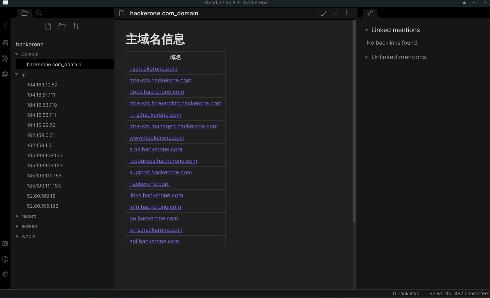

# 用途
  recon自动化, 提供域名或ip,进行whois查询，dns记录查询，ip端口扫描，http屏幕快照．
  
  
  生成markdown格式的报告，可以使用[Obsidian](https://obsidian.md/)或vscode的[markdown notes插件](https://marketplace.visualstudio.com/items?itemName=kortina.vscode-markdown-notes)打开,借助双向链接功能，方便查看．
  
# 使用方法

## 安装依赖程序

### amass 
   用于子域名查找,[下载地址](https://github.com/OWASP/Amass/releases)

### nmap
   用于服务扫描

### masscan
   用于端口发现

### aquatone
   用于屏幕快照,注意必须使用修改版，提供了session单独保存与合并的功能,下载地址:
   [aquatone](https://github.com/ntestoc3/aquatone/releases)

## 安装程序
  
  使用python3环境
  ```shell
  pip install norecon
  ```
  
## 使用方法
  norecon -p 项目保存目录　域名或ip 
  
  比如测试yahoo,支持一级域名或子域名
  ```shell
  norecon -v -p yahoo yahoo.com engadget.com login.aol.com
  ```
  如果中途中断，继续执行以上命令，会自动跳过已经扫描的部分．可使用--overwrite强制重新扫描．
  
  也可以在项目执行完毕后再添加ip或域名,或只进行ip扫描(支持cidr子网或ip范围):
  ```shell
  norecon -v -p yahoo 202.165.107.00/28 119.161.10.15-119.161.10.40 106.10.236.40
  ```

  扫描完成后，生成报告:
  ```shell
  noreport -v yahoo
  ```
  
## 报告截图
  使用Obsidian显示报告结果
  
